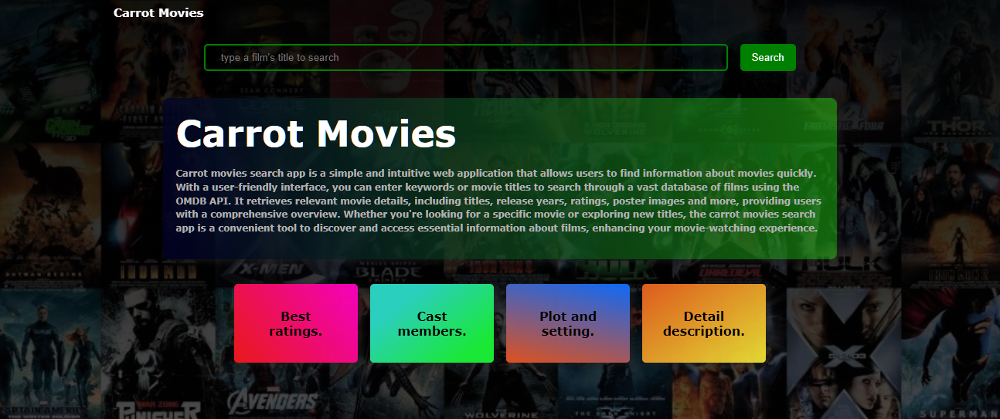
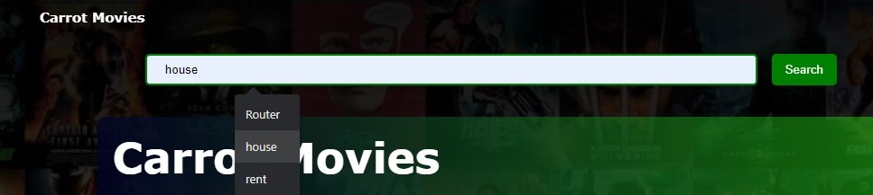
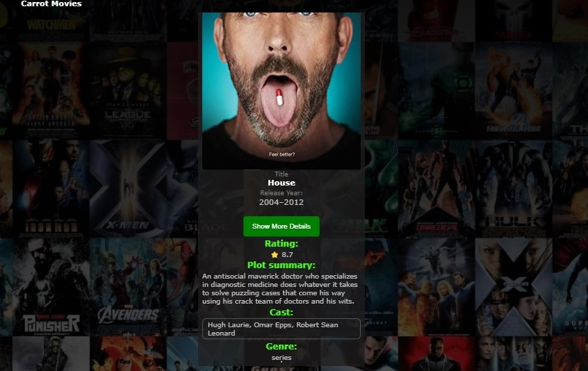
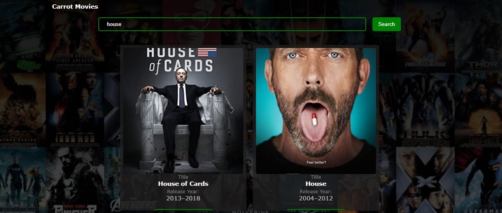

# Movie Search App


The Carrot Movies is a web application that allows users to search for movies and retrieve detailed information about them using the OMDB API. This app provides an easy and convenient way to explore and discover movies based on specific criteria such as title, keyword, or genre. By leveraging the OMDB API, the app provides access to a vast database of movie information, including titles, release years, ratings, plot summaries, cast, and more.

## Features

- Search for movies by title or keyword
  
- Retrieve movie details such as release year, rating, plot, and cast
  
- Display movie posters for visual representation
  
- Toggle between showing more or less details for each movie

## Technologies Used

- HTML
- CSS
- JavaScript

## Getting Started

To use the Movie Search App, follow these steps:

1. Clone the repository:

```bash
git clone https://github.com/kc-clintone/movies-search-app.git
```

2. Navigate to the project directory:

```bash
cd movies-search-app
```

3. Open the `index.html` file in a web browser.

## Usage

1. Enter a movie title or keyword in the search input field.
2. Press the Enter key or click the "Search" button next to the search bar.
3. The app will retrieve the matching movies from the OMDB API.
4. The movie results will be displayed, including the title, release year, rating, and a "View More" button.
5. To view additional details such as the plot and cast, click the "View More" button. The button will toggle between "View Less" and "View More" depending on the current state.
6. Scroll through the movie results to explore more movies.
7. To search for another movie, click the cancel button next to search button to reset the app and then repeat steps 1-6.

## API Key (Optional)

This part is optional, the app utilizes the OMDB API to fetch movie data. To use the app, you need to obtain an API key from the OMDB website (http://www.omdbapi.com/) and replace `'apikey=123test'` in the `app.js` file with your actual API key as shown below.

```javascript
const url = `http://www.omdbapi.com/?apikey=123test&s=${query}&page=${page}`;
```

## Contributing

Contributions are welcome! If you find any bugs or have suggestions for improvements, please open an issue or submit a pull request ,thank you.

## License

This project is licensed under the [MIT License](LICENSE).

---
